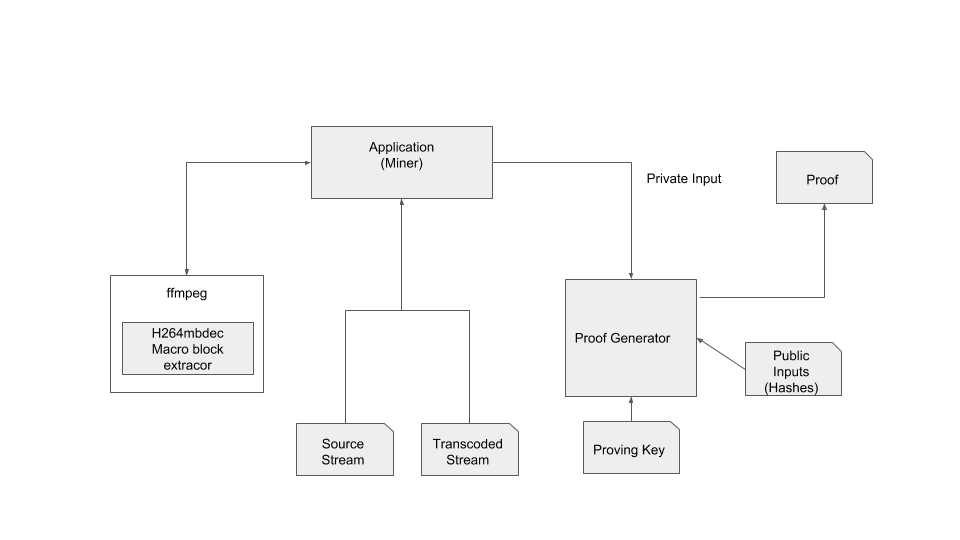

## Using ffmpeg to drive transcode proof generation : Overview

 

An ffmpeg application is used to retrieve macrobocks from source and transcode streams and supply to transcode proof generation.

```
typedef struct _MB_T
{
	int mb_type;
	int mb_x;
	int mb_y;
    int mb_xy;
    int mb_width;

    int16_t mb[16*16];  // Macroblock DCT Coefficients
    int16_t mb_luma_dc[16];
    int dequant_coeff;
    uint8_t non_zero_count_cache[15 * 8];

    // This data will be used to decode macroblock
    uint8_t top_border[8 + 16 + 8];
    uint8_t luma_top[8 + 16 + 8];
    uint8_t luma_left[16];
    int mb_field_decoding_flag;
    int deblocking_filter;
    int intra16x16_pred_mode;
} MB_T;
```

## Compilation Guide
https://trac.ffmpeg.org/wiki/CompilationGuide/Ubuntu

In addition to installing dependencies as per the above guide, the following additional dependencies may be installed
```
sudo apt-get install libbz2-dev
sudo apt-get install libssl-dev
```

After installing the dependencies as per the above guide, use the following command to fetch the ffmpeg from github and compile (instead of using the step to compile the ffmpeg command from the guide).


```
PATH="$HOME/bin:$PATH" PKG_CONFIG_PATH="$HOME/ffmpeg_build/lib/pkgconfig" ./configure \
  --prefix="$HOME/ffmpeg_build" \
  --pkg-config-flags="--static" \
  --extra-cflags="-I$HOME/ffmpeg_build/include" \
  --extra-ldflags="-L$HOME/ffmpeg_build/lib" \
  --extra-libs="-lpthread -lm" \
  --bindir="$HOME/bin" \
  --enable-gpl \
  --enable-libaom \
  --enable-libass \
  --enable-libfdk-aac \
  --enable-libfreetype \
  --enable-libmp3lame \
  --enable-libopus \
  --enable-libvorbis \
  --enable-libvpx \
  --enable-libx264 \
  --enable-libx265 \
  --enable-nonfree \
  --disable-optimizations

PATH="$HOME/bin:$PATH" make

make install
```


## Customization for driving transcode proof system
The customization includes the following:
* Adding a new codec in libavcodec folder in libavcodec folder and necessay changes to the ffmpeg system for allowing an application to use the codec. The codec is based on the h264 decoder. It supports extraction of a macroblock from a frame.
* An application that uses the above codec and retrieves the macroblock and supplies to transcode verification proof generation library.


## Deatils of the modifications files

### h264mbdec.h (New file based on h264dec.h)
```
/**
 * H264MBContext
 */
typedef struct H264MBContext {
    const AVClass *class;
    AVCodecContext *avctx;
    VideoDSPContext vdsp;
    H264DSPContext h264dsp;
    H264ChromaContext h264chroma;
    H264QpelContext h264qpel;

    H264Picture DPB[H264_MAX_PICTURE_COUNT];
    H264Picture *cur_pic_ptr;
    H264Picture cur_pic;
    H264Picture last_pic_for_ec;

    H264SliceContext *slice_ctx;
    int            nb_slice_ctx;
    int            nb_slice_ctx_queued;

    H2645Packet pkt;

    int pixel_shift;    ///< 0 for 8-bit H.264, 1 for high-bit-depth H.264

    /* coded dimensions -- 16 * mb w/h */
    int width, height;
    int chroma_x_shift, chroma_y_shift;

    int droppable;
    int coded_picture_number;

    int context_initialized;
    int flags;
    int workaround_bugs;
    int x264_build;
    /* Set when slice threading is used and at least one slice uses deblocking
     * mode 1 (i.e. across slice boundaries). Then we disable the loop filter
     * during normal MB decoding and execute it serially at the end.
     */
    int postpone_filter;

    /*
     * Set to 1 when the current picture is IDR, 0 otherwise.
     */
    int picture_idr;

    int crop_left;
    int crop_right;
    int crop_top;
    int crop_bottom;

    int8_t(*intra4x4_pred_mode);
    H264PredContext hpc;

    uint8_t (*non_zero_count)[48];

#define LIST_NOT_USED -1 // FIXME rename?
#define PART_NOT_AVAILABLE -2

    /**
     * block_offset[ 0..23] for frame macroblocks
     * block_offset[24..47] for field macroblocks
     */
    int block_offset[2 * (16 * 3)];

    uint32_t *mb2b_xy;  // FIXME are these 4 a good idea?
    uint32_t *mb2br_xy;
    int b_stride;       // FIXME use s->b4_stride

    uint16_t *slice_table;      ///< slice_table_base + 2*mb_stride + 1

    // interlacing specific flags
    int mb_aff_frame;
    int picture_structure;
    int first_field;

    uint8_t *list_counts;               ///< Array of list_count per MB specifying the slice type

    /* 0x100 -> non null luma_dc, 0x80/0x40 -> non null chroma_dc (cb/cr), 0x?0 -> chroma_cbp(0, 1, 2), 0x0? luma_cbp */
    uint16_t *cbp_table;

    /* chroma_pred_mode for i4x4 or i16x16, else 0 */
    uint8_t *chroma_pred_mode_table;
    uint8_t (*mvd_table[2])[2];
    uint8_t *direct_table;

    uint8_t scan_padding[16];
    uint8_t zigzag_scan[16];
    uint8_t zigzag_scan8x8[64];
    uint8_t zigzag_scan8x8_cavlc[64];
    uint8_t field_scan[16];
    uint8_t field_scan8x8[64];
    uint8_t field_scan8x8_cavlc[64];
    uint8_t zigzag_scan_q0[16];
    uint8_t zigzag_scan8x8_q0[64];
    uint8_t zigzag_scan8x8_cavlc_q0[64];
    uint8_t field_scan_q0[16];
    uint8_t field_scan8x8_q0[64];
    uint8_t field_scan8x8_cavlc_q0[64];

    int mb_y;
    int mb_height, mb_width;
    int mb_stride;
    int mb_num;

    // =============================================================
    // Things below are not used in the MB or more inner code

    int nal_ref_idc;
    int nal_unit_type;

    int has_slice;          ///< slice NAL is found in the packet, set by decode_nal_units, its state does not need to be preserved outside h264_decode_frame()

    /**
     * Used to parse AVC variant of H.264
     */
    int is_avc;           ///< this flag is != 0 if codec is avc1
    int nal_length_size;  ///< Number of bytes used for nal length (1, 2 or 4)

    int bit_depth_luma;         ///< luma bit depth from sps to detect changes
    int chroma_format_idc;      ///< chroma format from sps to detect changes

    H264ParamSets ps;

    uint16_t *slice_table_base;

    H264POCContext poc;

    H264Ref default_ref[2];
    H264Picture *short_ref[32];
    H264Picture *long_ref[32];
    H264Picture *delayed_pic[MAX_DELAYED_PIC_COUNT + 2]; // FIXME size?
    int last_pocs[MAX_DELAYED_PIC_COUNT];
    H264Picture *next_output_pic;
    int next_outputed_poc;

    /**
     * memory management control operations buffer.
     */
    MMCO mmco[MAX_MMCO_COUNT];
    int  nb_mmco;
    int mmco_reset;
    int explicit_ref_marking;

    int long_ref_count;     ///< number of actual long term references
    int short_ref_count;    ///< number of actual short term references

    /**
     * @name Members for slice based multithreading
     * @{
     */
    /**
     * current slice number, used to initialize slice_num of each thread/context
     */
    int current_slice;

    /** @} */

    /**
     * Complement sei_pic_struct
     * SEI_PIC_STRUCT_TOP_BOTTOM and SEI_PIC_STRUCT_BOTTOM_TOP indicate interlaced frames.
     * However, soft telecined frames may have these values.
     * This is used in an attempt to flag soft telecine progressive.
     */
    int prev_interlaced_frame;

    /**
     * Are the SEI recovery points looking valid.
     */
    int valid_recovery_point;

    /**
     * recovery_frame is the frame_num at which the next frame should
     * be fully constructed.
     *
     * Set to -1 when not expecting a recovery point.
     */
    int recovery_frame;

/**
 * We have seen an IDR, so all the following frames in coded order are correctly
 * decodable.
 */
#define FRAME_RECOVERED_IDR  (1 << 0)
/**
 * Sufficient number of frames have been decoded since a SEI recovery point,
 * so all the following frames in presentation order are correct.
 */
#define FRAME_RECOVERED_SEI  (1 << 1)

    int frame_recovered;    ///< Initial frame has been completely recovered

    int has_recovery_point;

    int missing_fields;

    /* for frame threading, this is set to 1
     * after finish_setup() has been called, so we cannot modify
     * some context properties (which are supposed to stay constant between
     * slices) anymore */
    int setup_finished;

    int cur_chroma_format_idc;
    int cur_bit_depth_luma;
    int16_t slice_row[MAX_SLICES]; ///< to detect when MAX_SLICES is too low

    /* original AVCodecContext dimensions, used to handle container
     * cropping */
    int width_from_caller;
    int height_from_caller;

    int enable_er;

    H264SEIContext sei;

    AVBufferPool *qscale_table_pool;
    AVBufferPool *mb_type_pool;
    AVBufferPool *motion_val_pool;
    AVBufferPool *ref_index_pool;
    int ref2frm[MAX_SLICES][2][64];     ///< reference to frame number lists, used in the loop filter, the first 2 are for -2,-1
#define MAX_MB_DATA_SIZE 4*1024
    // H264MB Specific data
    int             req_mb_num;
    int             crnt_frame_num;
    int             req_frame_num;
    int             debug;
    int             debug_dct_coef;
    int             debug_luma;
    int             debug_context;

    int             mb_type;
    int             mb_x;
    int             _mb_y; // mb_y is defined already
    int             mb_xy;

    // Data related to macroblock DC coefficients
    int16_t         mb_data[16 * 16]; // luma DC plane
    int16_t         mb_luma_dc[16];
    uint8_t         non_zero_count_cache[15 * 8];
    int             dequant_coeff;

    // Data related to macroblock prediction
    uint8_t         top_border[8 + 16 + 8];
    uint8_t         luma_top[8 + 16 + 8];
    uint8_t         luma_left[16];
    int             mb_field_decoding_flag;
    int             deblocking_filter;
    int             intra16x16_pred_mode;
} H264MBContext;


static int output_frame(H264Context *h, AVFrame *dst, H264Picture *srcp)
{
// code to return macroblock data to the application
}
```

H264Mb specific data:

`int req_mb_num` - number of macroblock requested by application

`int crnt_frame_num` - current decoding frame (not used)

`int req_frame_num` - number of frame requested by application

`int debug` - if `1` - enable all H264MB specific logs

`int debug_dct_coef` - if `1` - enable DCT specific logs

`int debug_luma` - if `1` - enable Luma specific logs

`int debug_context` - if `1` - enable H264MBContext logs

`int mb_type` - macroblock type

`int mb_x` - "row number" (cell width 16) of macroblock in video frame

`int _mb_y` - "column number" (cell width 16) of macroblock in video frame (`mb_y` is taken already)

`int mb_xy` - number of macroblock (`mb_x*mb_width + mb_y`)  in video frame

`int16_t mb_data[16 * 16]` - macroblock IDCT coefficients

`int16_t mb_luma_dc[16]` - macroblock luma dc values

`uint8_t non_zero_count_cache[15 * 8]` - cached values from CABAC step

`int dequant_coeff` - dequantisation coefficient for IDCT values

`uint8_t top_border[8 + 16 + 8]` - luma top border values

`uint8_t luma_top[8 + 16 + 8]` - luma values of neighbouring top macroblocks 

`uint8_t luma_left[16]` - luma values of neighbouring left macroblock

`int mb_field_decoding_flag` - decoding flag

`deblocking_filter` - deblocking filter flag

`intra16x16_pred_mode` - intra16x16 prediction mode


```
AVCodec ff_h4mb_decoder = {
    .name                  = "h4mb",
    .long_name             = NULL_IF_CONFIG_SMALL("H.264 Macroblock decoder"),
    .type                  = AVMEDIA_TYPE_VIDEO,
    .id                    = AV_CODEC_ID_H4MB,
    .priv_data_size        = sizeof(H264MBContext),
    .init                  = h264_decode_init,
    .close                 = h264_decode_end,
    .decode                = h264_decode_frame,
    .capabilities          = /*AV_CODEC_CAP_DRAW_HORIZ_BAND |*/ AV_CODEC_CAP_DR1 |
                             AV_CODEC_CAP_DELAY | AV_CODEC_CAP_SLICE_THREADS |
                             AV_CODEC_CAP_FRAME_THREADS,
    .hw_configs            = (const AVCodecHWConfigInternal*[]) {

                               NULL
                           },
    .caps_internal         = FF_CODEC_CAP_INIT_THREADSAFE | FF_CODEC_CAP_EXPORTS_CROPPING,
    .flush                 = flush_dpb,
    .init_thread_copy      = ONLY_IF_THREADS_ENABLED(decode_init_thread_copy),
    .update_thread_context = ONLY_IF_THREADS_ENABLED(ff_h264_update_thread_context),
    .profiles              = NULL_IF_CONFIG_SMALL(ff_h264_profiles),
    .priv_class            = &h264mb_class,
};
```
### libavcodec/avcodec.h
```
enum CodecID {
...
    AV_CODEC_ID_H4MB  = 0x22000,
};
```

### codec_list.c
```
static const AVCodec * const codec_list[] = {
    &ff_a64multi_encoder,
    ...
    &ff_h4mb_decoder,
    NULL };
};    
```

### Makefile in libavcodec folder
```
...
OBJS-$(CONFIG_H4MB_DECODER)            += h264mbdec.o h264mb_cabac.o h264mb_cavlc.o \
                                          h264_direct.o h264_loopfilter.o  \
                                          h264_mb.o h264_picture.o \
                                          h264_refs.o h264_sei.o \
                                          h264mb_slice.o h264data.o
...
```                                          

### h264mb_slice.c
Modifications to extract macroblock data
```
static void save_h264mb_context(H264MBContext *h, H264SliceContext *sl)
{
    // save the comtext required to extract macroblock data
}
```

`save_h264mb_context` usage:
```
static int decode_slice(struct AVCodecContext *avctx, void *arg)
{
    ...
    
    H264MBContext *hmb = sl->h264;
    
    ...
    
    if(hmb->req_mb_num == sl->mb_xy)
        save_h264mb_context(h, sl);
    ff_h264_hl_decode_mb(h, sl);
    
    ...
    
}
```

### H264MBContext structure

```
                               macroblock at mb_x-1;mb_y-1             macroblock at mb_x;mb_y-1               macroblock at mb_x+1;mb_y-1
                                    --------------------->|  |<------------------------------------------->|  |<----------------------
top_border =>                       d8 d6 d5 d2 d7 d4 d1 d5  da d8 d3 e0 d2 d5 d3 e0 d6 d5 d3 d6 df d9 dd e1  d7 d6 d6 d7 de dd db dd 
luma_top   =>                       d8 d6 d5 d2 d7 d4 d1 d5  dc d3 de d5 d9 db db d8 da d8 d3 e0 d2 d5 d3 e0  d6 d5 d3 d6 df d9 dd e1 
                                        
                                                         d5  d6 e2 d5 d6 d3 e1 db dc d5 d2 d7 d8 d1 d4 cf d0                            
                                                         cf  d6 d7 d7 d3 d5 d6 d7 d8 d2 d6 d9 d5 d7 d6 d3 d4                             
                                                         d0  dd c9 d9 d8 d6 d5 d4 d3 d7 cf d8 d8 da d7 ca d1                            
                                                         d3  d4 db d8 dc d4 df d5 d3 d0 db d2 d9 dc cd da d9 
                                                         d3  da c9 ce d8 d8 d9 d0 d3 d7 d7 d7 d7 db d7 d4 d7 
                                                         d7  d9 d4 d6 d8 d5 d8 d6 d6 d7 d7 d7 d7 da d5 d6 d7 
                                                         d2  d6 d4 d2 d7 d6 da dc d5 d7 d7 d7 d7 d9 d2 d9 d8 
                                                         d1  d4 de d9 d6 db dc dd d0 d7 d7 d7 d7 d9 d0 db d9 
                                                         dd  d2 d7 d0 d5 d3 df db d8 d4 d4 da d6 d6 ce d5 d4 
                                                         d0  d5 d7 cc db d6 dd d9 d5 d6 da d9 d1 cd d3 d7 d7 
                                                         d6  db d2 d5 d9 d5 d5 d9 d6 db cf d4 d4 d9 d5 dd d3 
                                                         ce  d7 d8 d7 d8 d0 cf db db d8 e0 d6 e2 d0 cd d2 d6 
                                                         da  de d2 d7 d2 d9 d7 d5 dc dd db d9 cd d2 d3 db d9 
                                                         d3  d8 d6 d4 d9 d0 d6 d3 dd d7 d7 d9 d3 d5 d4 d5 d3 
                                                         d2  db dc d6 de db d7 de d6 d7 d1 cf db e3 d5 d8 d9 
                                                         dd  da d5 d0 d2 d2 d5 db d7 d3 d7 d1 d3 d3 e1 d5 d8                            
                                                         
                                                         ^
                                                     luma_left
```

### How macroblock decoding works

Flow:

1. Deblocking (if enabled)
2. Macroblock luma prediction
3. Dequantity IDCT coefficients
4. Apply IDCT coefficients to predicted luma values

 
`top_border` and `luma_top` are used for deblocking filter if `deblocking_filter` is enabled.

`luma_top`, `luma_left`, are used for macroblock prediction based on `intra16x16_pred_mode` mode.

`dequant_coeff` and `mb_luma_dc` are used to dequantify `mb_data` (IDCT coefficients)
 
`mb_data` and predicted luma values are combined together to fully decode macroblock.

